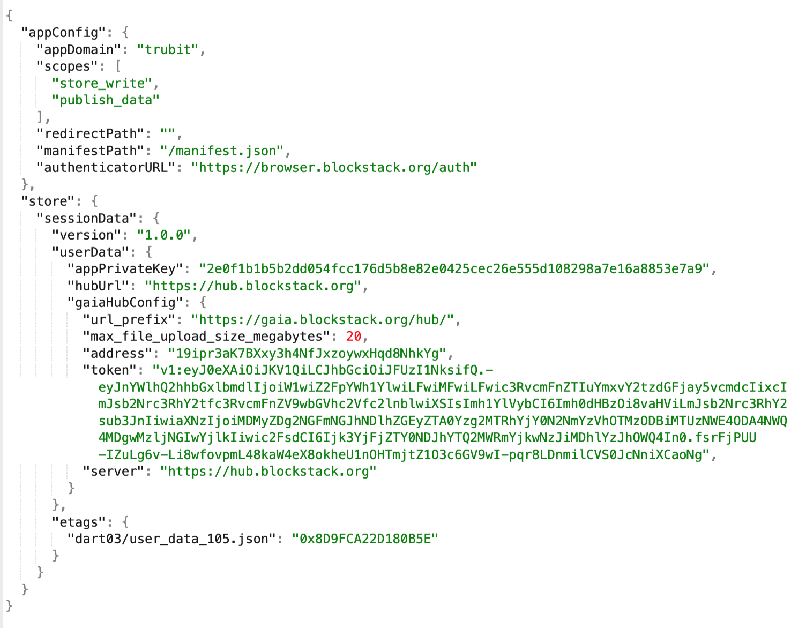

### *Gaia with Stacks.js*


## The GAIATOR by Trubit - *a Storage class utility*
A lightweight extension of Storage functions : putfile(), getFile(), listFiles() and deleteFile().    
  
The GAIATOR module : ```gaiator.ts```    
  
### Test examples:

1. Put file : ```node gaiatorCreate.js```

2. Read file : ```node gaiatorRead.js```

3. List files : ```node gaiatorList.js```

4. Delete file : ```node gaiatorDelete.js```  

  
### Sample Gaia file

Complete URL:
https://gaia.blockstack.org/hub/19ipr3aK7BXxy3h4NfJxzoywxHqd8NhkYg/dart03/user_data_105.json

App Config Example

