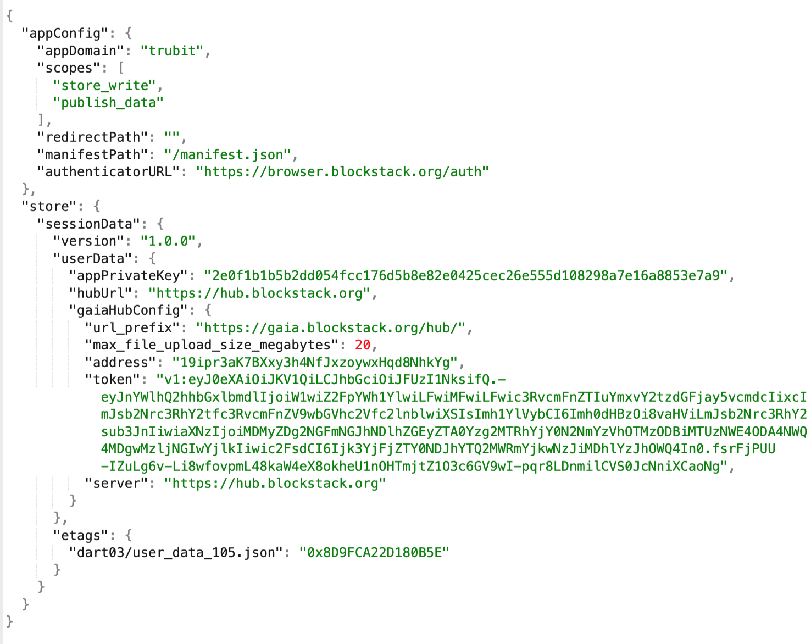

### *Gaia with Stacks.js*


## The GAIATOR by Trubit - *a Storage class utility*
A lightweight extension of Storage functions : putfile(), getFile(), listFiles() and deleteFile().    

### Modules  

1. The GAIATOR module : ```gaiator.ts```

2. Customer data writer : ```createCustomerData.ts```

  
### Test examples:

1. Put file : ```node gaiatorCreate.js```

2. Read file : ```node gaiatorRead.js```

3. List files : ```node gaiatorList.js```

4. Delete file : ```node gaiatorDelete.js```  

  
### Sample Gaia files

File Encrypted:
https://gaia.blockstack.org/hub/19ipr3aK7BXxy3h4NfJxzoywxHqd8NhkYg/customer_data/sample_01_encrypted.json

File Unecrypted:
https://gaia.blockstack.org/hub/19ipr3aK7BXxy3h4NfJxzoywxHqd8NhkYg/customer_data/sample_01_unencrypted.json


App Config Example

